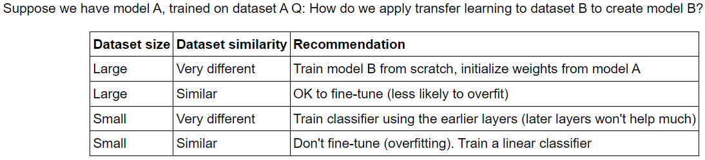

# Deep Learning with PyTorch

* **Part 1:** Introduction to PyTorch and using tensors
	* For `autograd` in PyTorch, see `./guide_autograd_1.ipynb`, and `./guide_autograd_2_linear_regression_from_scratch.ipynb`

	* [guide_datasets_1](./guide_datasets_1.ipynb): How to use `torch.utils.data.Dataset` and `torch.utils.data.DataLoader`.
* [HDF5 in PyTorch](https://github.com/ashkan-abbasi66/pytorch-hdf5/tree/master) Creating a Dataset object to be used by HDF5 files in PyTorch. 

* **Part 2:** Building fully-connected neural networks with PyTorch

* `Part 3 - Training Neural Networks - MNIST.ipynb`: How to train a fully-connected network with backpropagation on MNIST. 

* **Part 4:** Train a neural network (MLP) on Fashion-MNIST

* **Part 5:** Fashion-MNIST; Training, Validation, Inference. How to reduce overfitting through Early Stopping or Dropout.
  * [**Introduction to Dropout**](https://machinelearningmastery.com/dropout-for-regularizing-deep-neural-networks/)
  * MNIST; [Basic MLP](https://github.com/rasbt/deeplearning-models/blob/master/pytorch_ipynb/mlp/mlp-basic.ipynb); [MLP w/ dropout](https://github.com/rasbt/deeplearning-models/blob/master/pytorch_ipynb/mlp/mlp-dropout.ipynb); [MLP w/ BN](https://github.com/rasbt/deeplearning-models/blob/master/pytorch_ipynb/mlp/mlp-batchnorm.ipynb)
  * [An example in Keras](https://github.com/christianversloot/machine-learning-articles/blob/main/how-to-use-dropout-with-keras.md) - [Example 2 in Keras](./assets/Dropout_Example.pdf)
  * **[CIFAR10; Dropout with different drop rates in practice](https://medium.com/@amarbudhiraja/https-medium-com-amarbudhiraja-learning-less-to-learn-better-dropout-in-deep-machine-learning-74334da4bfc5)**
  * [State of the art results on Fashion MNIST](https://paperswithcode.com/sota/image-classification-on-fashion-mnist).

* **Part 6:** How to save and load trained models
	* [`./mlp-mnist/`](./mlp-mnist/): MLP applied to MNIST ~ 98% accuracy on test.

* **CNN** 
	*  `./cnn-basic-operations`: Applying custom filters and max-pooling.
	* `./cnn-cifar/`: A simple CNN applied to CIFAR10 dataset w/ or w/o data augmentation.

* **Part 7:** Load image data with `torchvision` + data augmentation

    * `./cnn-cifar/`: Example of a CNN w/ data augmentation on CIFAR10.
      * [ ] Apply [Random Erasing Data Augmentation with PyTorch experiments with ResNet variants on CIFAR10, CIFAR100 and Fashion-MNIST](https://github.com/zhunzhong07/Random-Erasing)

* **Part 8:** Leverage the power of *pretrained* state-of-the-art image classifiers for your own dataset.
  * [Lecture from CS231n](https://cs231n.github.io/transfer-learning/)
  * Feature Extraction Approach:
  	* `Part 8 - Transfer Learning - ResNet18.ipynb` - on Dogs vs. Cats Kaggle dataset.
  	* [`./transfer-learning`](./transfer-learning): Oxford 102 Flowers dataset
  * Fine-tuning Approach: 
  	* [ ] Practical Example ? - See [1](https://d2l.ai/chapter_computer-vision/fine-tuning.html), [2](https://www.tensorflow.org/tutorials/images/transfer_learning), [3](https://lisaong.github.io/mldds-courseware/03_TextImage/transfer-learning.slides.html)
  	* When and how to fine-tune?
  	

* **Autoencoder**: [`./autoencoder/`](./autoencoder)
  * Linear autoencoders
  * Convolutional autoencoders
      * Transpoed Convolution
  * Denoising autoencoders

* **Segmentation**:
  * Fully Convolutional Networks:
    * [`./segmentation/fcn/`](./segmentation/fcn/): Semantic segmentation on PASCAL VOC 2012 with ResNet18 as feature extractor.
    * See also, Modern Computer Vision with PyTorch for implementing UNet from scratch.
  * [segmentation_models.pytorch](https://github.com/qubvel/segmentation_models.pytorch) library:
    * [`./segmentation/udcity_unet_exercise/`](./segmentation/udcity_unet_exercise/)
    * Training model for cars segmentation on [CamVid](http://mi.eng.cam.ac.uk/research/projects/VideoRec/CamVid/) dataset using [segmentation_models.pytorch](https://github.com/qubvel/segmentation_models.pytorch/blob/master/examples/cars%20segmentation%20(camvid).ipynb)

* **Object Detection**: [`./od/`](./od)
  * `bounding-box-representations`
  * `udcity_od_exercise`

* [ ] **RNN**: `./rnn/`
  * [Embeddings (Word2Vec)](./rnn/word2vec-embeddings): Implement the Word2Vec model to find semantic representations of words for use in natural language processing. ([org. link](https://github.com/udacity/deep-learning-v2-pytorch/tree/master/word2vec-embeddings))
  * **[LSTM examples](./rnn/lstm-1)**


---------------------------
* [ ] **Weight Initialization:** All zeros/ones; Uniform/Normal distributions; `./weight-initialization`
  * More on weight initialization: [link 1](https://uvadlc-notebooks.readthedocs.io/en/latest/tutorial_notebooks/tutorial4/Optimization_and_Initialization.html#How-to-find-appropriate-initialization-values); [link 2](https://www.askpython.com/python-modules/initialize-model-weights-pytorch)
* [ ] **Batch normalization**: `batch-norm` folder; 
  * [rasbt/batchnorm](../rasbt-intro-to-DL/L11/code/batchnorm.ipynb)
  * [A simple implementation of Batch Normalization using pytorch.](https://github.com/Johann-Huber/batchnorm_pytorch) [copied in batch-norm folder]


- - -

Datasets used in this course:
* MNIST:
* Fashion MNIST:
* CIFAR-10:
* Oxford 102 Flowers:
* PASCAL VOC 2012:`./fcn/`; 
* CamVid: Segmentation dataset with per-pixel semantic segmentation of over 700 images. [link1](https://s3.amazonaws.com/fast-ai-imagelocal/camvid.tgz); [link2 from Kaggle](https://www.kaggle.com/datasets/carlolepelaars/camvid)
* Misc. Links:
	* https://course.fast.ai/datasets
- - -


# More Specific Notes


* **Set seed for random number generators**
```python
# use `torch.seed()` to get the current seed.
def set_seed(seed):
    random.seed(seed)
    np.random.seed(seed)
    torch.manual_seed(seed)  # Sets the seed for generating random numbers.
    if torch.cuda.is_available():
        torch.cuda.manual_seed(seed)
        torch.cuda.manual_seed_all(seed)
```


* **[guide_loss_functions_in_pytorch](./guide_loss_functions_in_pytorch.ipynb)**: Use logits with `nn.CrossEntropyLoss`, and use `nn.LogSoftmax` with `nn.NLLLoss`. See also [`LogProbabilityAndLogSoftmax.pdf`](./assets/LogProbabilityAndLogSoftmax.pdf).


* **[guide_data_manipulation_layers](./guide_data_manipulation_layers.ipynb)**: max pooling (MaxPool2d), batch normalization (BatchNorm1d), Dropout.


* **[guide_Tensorboard_in_PyTorch](./guide_Tensorboard_in_PyTorch.ipynb)** - [video](https://www.youtube.com/watch?v=6CEld3hZgqc&list=PL_lsbAsL_o2CTlGHgMxNrKhzP97BaG9ZN&index=5)

  Usage: `tensorboard --logdir=logs`


# Model Benchmarking

Benchmarking different models on different datasets:

- [Keras implementation of various CNNs on CIFAR-10 dataset](https://github.com/BIGBALLON/cifar-10-cnn)
- [Justin Johnson's benchmarks for popular CNN models](https://github.com/jcjohnson/cnn-benchmarks)


# Others

**Todo**
- [ ] **SRCNN - Image Super-Resolution Using Deep Convolutional Networks (ECCV 2014); [here](https://github.com/yjn870/SRCNN-pytorch)**
- [ ] Tokenization - TEXT analysis.
- [x] 
- [x] CNN examples (MNIST; [Plain CNN](https://github.com/rasbt/deeplearning-models/blob/master/pytorch_ipynb/cnn/cnn-basic.ipynb); [CNN w/ He initialization](https://github.com/rasbt/deeplearning-models/blob/master/pytorch_ipynb/cnn/cnn-he-init.ipynb))
- [x] Implement different initialization methods in PyTorch 
- [ ] 


* Articles to be studied
    * **Convolutional neural networks (CNNs)**:
        - [Kernels](https://setosa.io/ev/image-kernels/)
        - [A friendly introduction to Convolutional Neural Networks and Image Recognition](https://www.youtube.com/watch?v=2-Ol7ZB0MmU)
        - [MIT 6.S191 (2021): Convolutional Neural Networks](https://www.youtube.com/watch?v=AjtX1N_VT9E)

    * **Transfer Learning**:
        - [Transfer Learning (C3W2L07) by Andrew Ng](https://www.youtube.com/watch?v=yofjFQddwHE)

    * **Optimization**:
          - [Unstable gradient problem (Vanishing / Exploding gradients)](http://neuralnetworksanddeeplearning.com/chap5.html)

